# Architecture Guide — Research Paper Catalog (KAN-4 MVP)

**Author:** @Architect  
**Version:** 1.1  
**Date:** 2026-03-08  

---

## Table of Contents

1. [System Overview](#1-system-overview)
2. [Deployment Architecture](#2-deployment-architecture)
3. [API Surface Reference](#3-api-surface-reference)
4. [Data Flow: PDF Upload](#4-data-flow-pdf-upload)
5. [Data Flow: arXiv Ingestion](#5-data-flow-arxiv-ingestion)
6. [Deduplication Logic](#6-deduplication-logic)
7. [Worker Pipeline](#7-worker-pipeline)
8. [Reference Resolution Chain](#8-reference-resolution-chain)
9. [Full-Text Search Architecture](#9-full-text-search-architecture)
10. [Database Schema (ER Diagram)](#10-database-schema-er-diagram)
11. [Frontend Architecture](#11-frontend-architecture)
12. [Configuration & Environment](#12-configuration--environment)
13. [Inter-Component Data Contracts](#13-inter-component-data-contracts)

---

## 1. System Overview

The system is a three-tier web application: a **Next.js frontend**, a **FastAPI backend**, and a **Huey background worker**. All three tiers share a single `./data/` directory on the host, giving them access to the SQLite database, the Huey task queue, and the PDF file store.

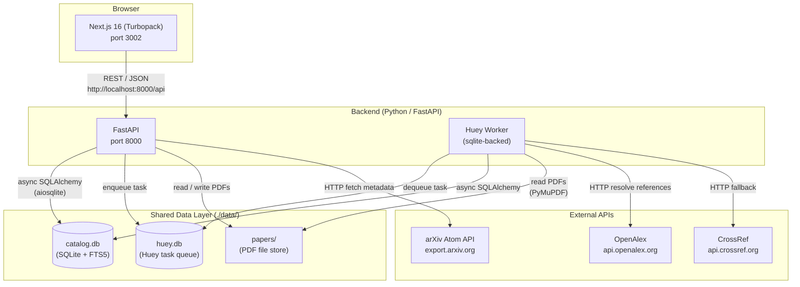

---

## 2. Deployment Architecture

### Local Development

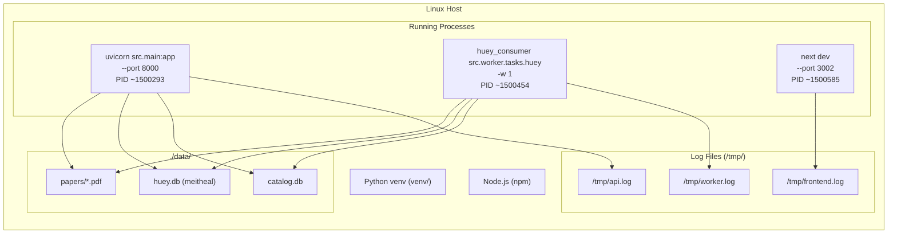

### Docker / Production

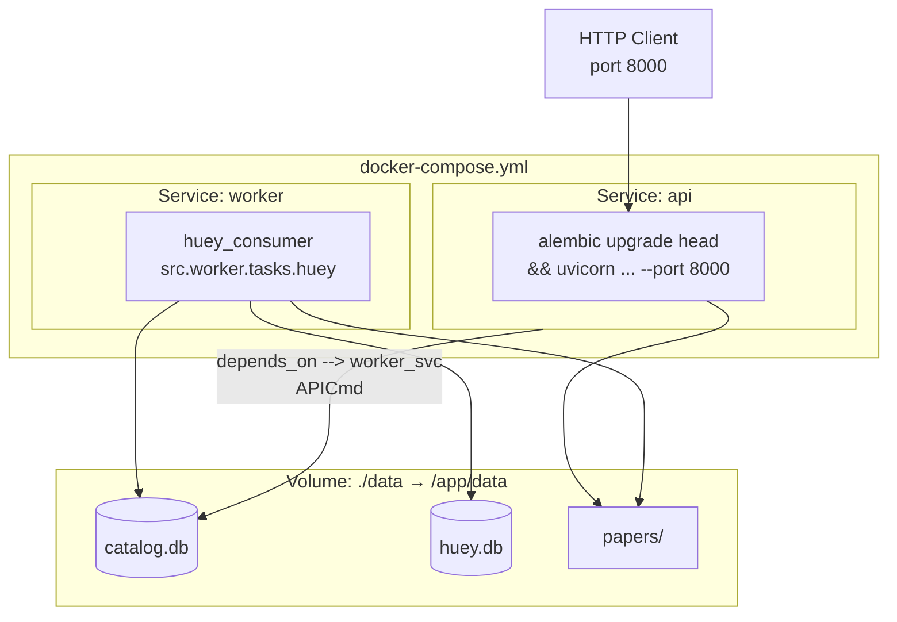

---

## 3. API Surface Reference

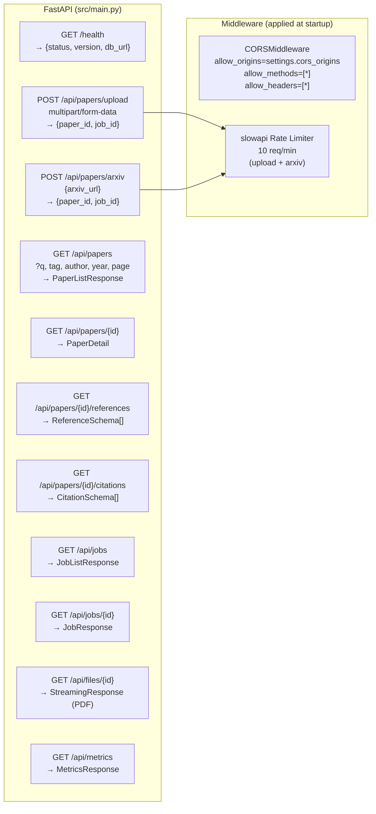

---

## 4. Data Flow: PDF Upload

This sequence covers what happens from the moment a user selects a PDF in the browser to the paper appearing in the catalog.

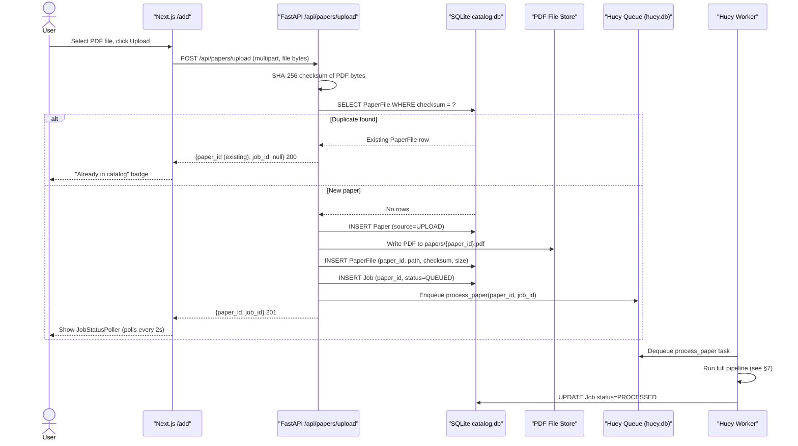

---

## 5. Data Flow: arXiv Ingestion

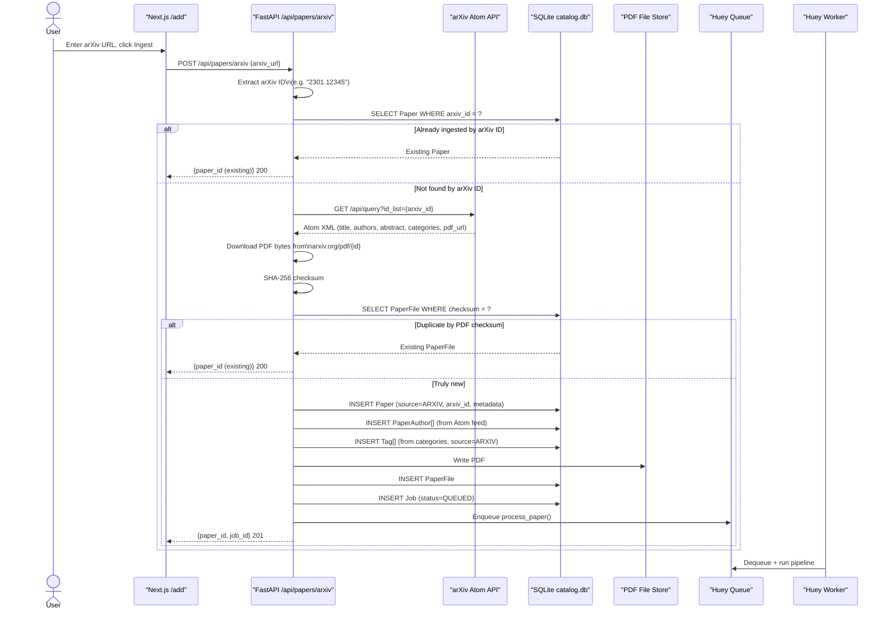

---

## 6. Deduplication Logic

The system applies three independent, layered deduplication checks to avoid reprocessing a paper already in the catalog.

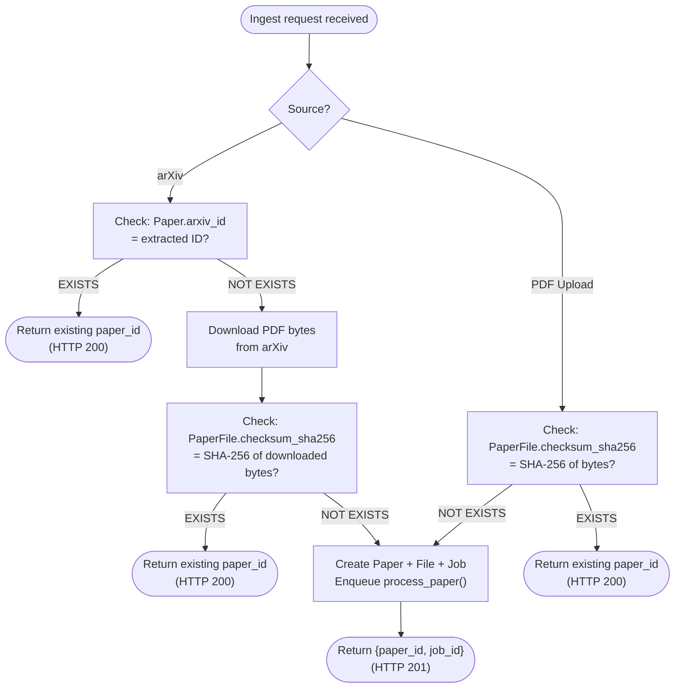

---

## 7. Worker Pipeline

The `process_paper` Huey task runs these seven sequential stages. Each stage reads from and writes to the shared SQLite database. If any stage raises an exception, the job is marked `FAILED` and the error message stored.

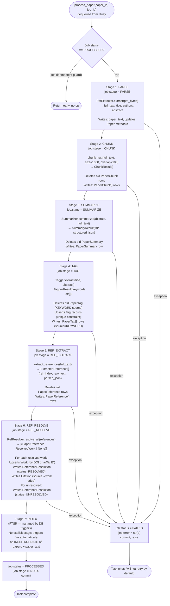

### Stage Inputs / Outputs Summary

| Stage | Reads | Writes | External I/O |
|---|---|---|---|
| PARSE | `PaperFile` (PDF bytes) | `paper_text`, `Paper.title/abstract/authors` | None |
| CHUNK | `paper_text.full_text` | `paper_chunks[]` | None |
| SUMMARIZE | `Paper.abstract`, `paper_text.full_text` | `paper_summaries` | None |
| TAG | `Paper.title`, `Paper.abstract` | `tags`, `paper_tags` | None |
| REF_EXTRACT | `paper_text.full_text` | `paper_references[]` | None |
| REF_RESOLVE | `paper_references[]` | `works`, `reference_resolutions`, `citations` | OpenAlex, CrossRef |
| INDEX | _(triggers fire automatically)_ | `paper_search` (FTS5) | None |

---

## 8. Reference Resolution Chain

`RefResolver.resolve_one()` runs three strategies in order, short-circuiting on the first success.

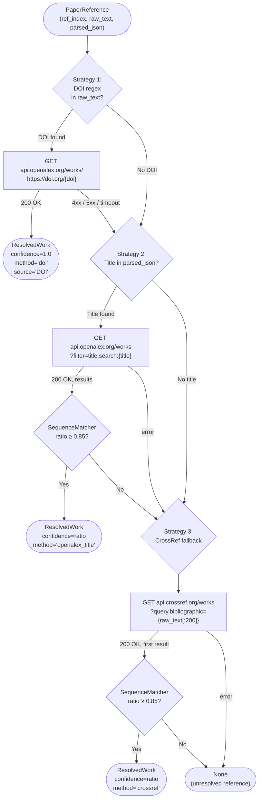

### Confidence & External Safety

- **Timeout:** 10 seconds for all HTTP calls (`httpx`)
- **User-Agent:** `papers-mvp/1.0 (mailto:research@meitheal.io)` (polite crawl header)
- **Exception handling:** `except Exception` wraps each strategy; a single network failure does not abort the whole pipeline
- **Confidence threshold:** 0.85 — below this, the match is discarded and the next strategy is tried

---

## 9. Full-Text Search Architecture

### FTS5 Table Structure

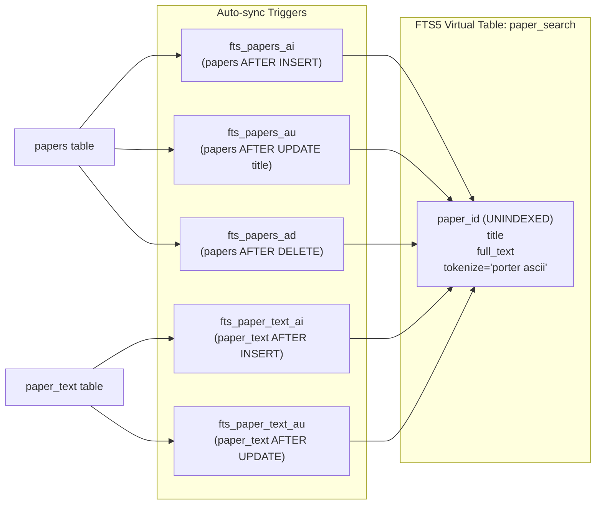

### Search Query Flow

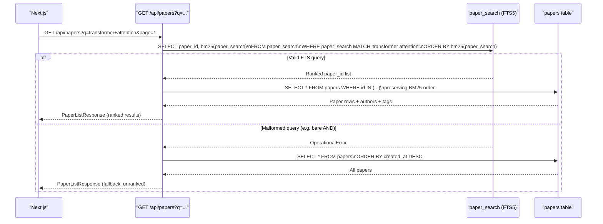

### Supported Filter Parameters

| Parameter | Search mechanism | Example |
|---|---|---|
| `q` | FTS5 MATCH (BM25 ranked) | `?q=neural+network` |
| `tag` | `paper_tags.tag = ?` join | `?tag=machine-learning` |
| `author` | `paper_authors.name LIKE ?` | `?author=LeCun` |
| `year` | `papers.published_year = ?` | `?year=2024` |

---

## 10. Database Schema (ER Diagram)

```mermaid
erDiagram
    papers {
        UUID id PK
        string source "UPLOAD | ARXIV"
        string title
        string abstract
        string arxiv_id "UNIQUE, nullable"
        int published_year
        datetime created_at
    }

    paper_authors {
        int id PK
        UUID paper_id FK
        int author_order "UNIQUE per paper"
        string name
    }

    paper_files {
        UUID id PK
        UUID paper_id FK
        string storage_path
        string checksum_sha256 "UNIQUE"
        int size_bytes
    }

    jobs {
        UUID id PK
        UUID paper_id FK
        string status "QUEUED|RUNNING|PROCESSED|FAILED"
        string stage "FETCH|PARSE|CHUNK|SUMMARIZE|TAG|REF_EXTRACT|REF_RESOLVE|INDEX"
        string error "nullable"
        datetime created_at
        datetime updated_at
    }

    paper_text {
        int id PK
        UUID paper_id FK "UNIQUE"
        text full_text
    }

    paper_chunks {
        int id PK
        UUID paper_id FK
        int chunk_index
        text text
        int start_offset
        int end_offset
    }

    paper_summaries {
        int id PK
        UUID paper_id FK "UNIQUE"
        text tldr
        text structured_json
        string model
        datetime created_at
    }

    tags {
        int id PK
        string tag "UNIQUE"
    }

    paper_tags {
        int id PK
        UUID paper_id FK
        int tag_id FK
        string source "KEYWORD|ARXIV|LLM"
    }

    paper_references {
        int id PK
        UUID paper_id FK
        int ref_index
        text raw_text
        text parsed_json "nullable"
    }

    works {
        int id PK
        string doi "UNIQUE, nullable"
        string arxiv_id "UNIQUE, nullable"
        string title
        int year
        string venue
        text authors_json
        string source "DOI|ARXIV|TITLE_SEARCH"
    }

    reference_resolutions {
        int id PK
        int reference_id FK "UNIQUE"
        int work_id FK
        float confidence
        string method
        string status "RESOLVED|UNRESOLVED"
    }

    citations {
        int id PK
        UUID source_paper_id FK
        int target_work_id FK
        UUID target_paper_id FK "nullable"
        datetime created_at
    }

    papers ||--o{ paper_authors : "has"
    papers ||--o{ paper_files : "has"
    papers ||--o{ jobs : "has"
    papers ||--o| paper_text : "has"
    papers ||--o{ paper_chunks : "has"
    papers ||--o| paper_summaries : "has"
    papers ||--o{ paper_tags : "has"
    papers ||--o{ paper_references : "has"
    papers ||--o{ citations : "cites (source)"
    papers ||--o{ citations : "cited by (target)"
    tags ||--o{ paper_tags : "used by"
    paper_references ||--o| reference_resolutions : "resolved to"
    works ||--o{ reference_resolutions : "resolves"
    works ||--o{ citations : "target work"
```

### Table Counts at a Glance

| Table | Growth driver |
|---|---|
| `papers` | 1 row per unique ingested paper |
| `paper_authors` | ~3-8 rows per paper |
| `paper_files` | 1 row per paper (one PDF) |
| `jobs` | 1+ per paper (retries create new rows) |
| `paper_text` | 1 row per paper (after PARSE) |
| `paper_chunks` | ~50-200 rows per paper (1000-char chunks) |
| `paper_summaries` | 1 row per paper |
| `paper_tags` | ~10 KEYWORD + N ARXIV tags per paper |
| `paper_references` | ~20-50 rows per paper |
| `works` | Shared across all papers (deduplicated by DOI) |
| `reference_resolutions` | 1 per reference |
| `citations` | 1 per resolved reference |

---

## 11. Frontend Architecture

### Component Tree

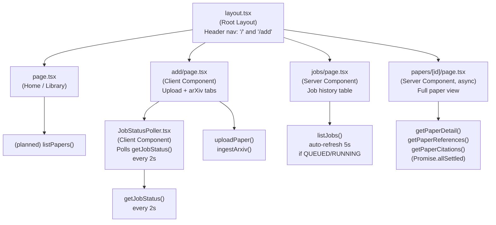

### Frontend Data Fetching Patterns

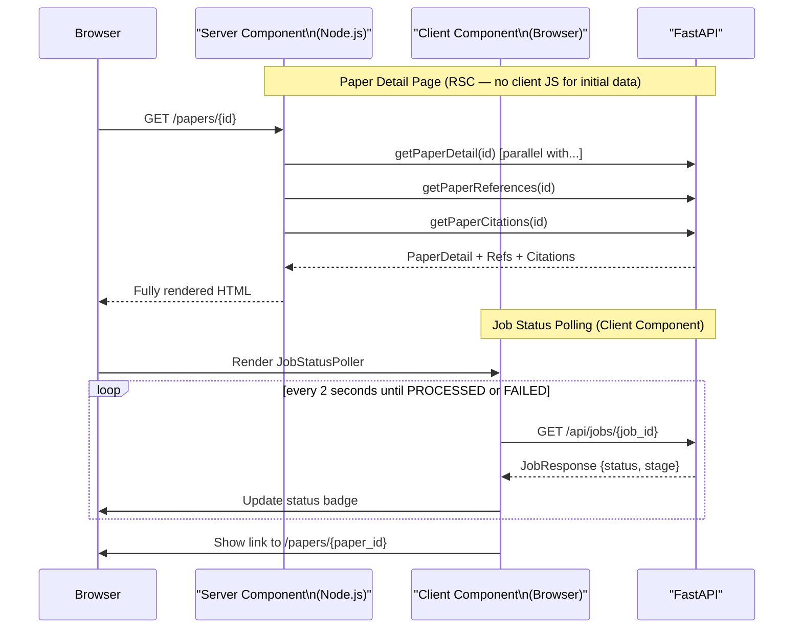

### Page Responsibilities

| Route | Rendering | Primary API Calls | Notes |
|---|---|---|---|
| `/` | Server Component | _(library index, planned)_ | Stub in MVP |
| `/add` | Client Component | `POST /api/papers/upload`, `POST /api/papers/arxiv` | Rate-limited 10/min |
| `/jobs` | Server Component | `GET /api/jobs` | Auto-refreshes if jobs are active |
| `/papers/[id]` | Server Component | `GET /api/papers/{id}`, `/references`, `/citations` | `notFound()` on fetch error |

---

## 12. Configuration & Environment

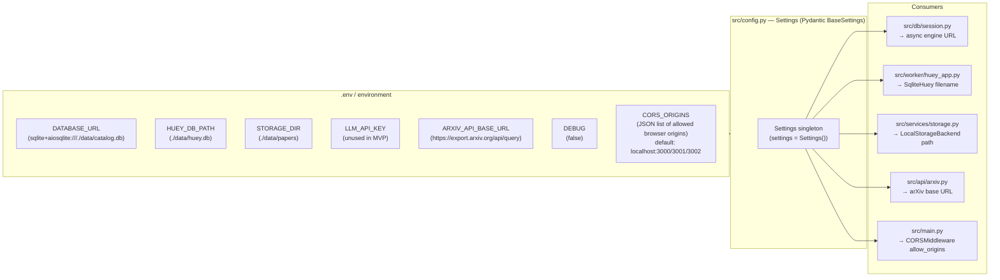

---

## 13. Inter-Component Data Contracts

This section documents the exact shapes passed between components at each boundary.

### Upload API → Worker

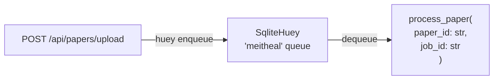

The only data passed over the queue is `paper_id` and `job_id` (both UUIDs as strings). The worker fetches all state it needs from the database — there is no large payload in the queue.

### PdfExtractor → Worker (extracted data)

```python
ExtractResult(
    full_text: str,
    title: str | None,
    authors: list[str],
    abstract: str | None,
)
```

### Chunker → Worker (chunk records)

```python
ChunkResult(
    chunk_index: int,
    text: str,
    start_offset: int,
    end_offset: int,
)
```

### Summarizer → Worker (summary record)

```python
SummaryResult(
    tldr: str,
    structured_json: str,  # JSON: {source_type, preview}
)
```

### Tagger → Worker (keyword list)

```python
TaggerResult(
    keywords: list[str],  # top-10, stop-words removed
)
```

### RefExtractor → Worker (raw references)

```python
ExtractedReference(
    ref_index: int,
    raw_text: str,
    parsed_json: str | None,  # JSON: {authors, title, year, venue}
)
```

### RefResolver → Worker (resolved works)

```python
ResolvedWork(
    title: str,
    doi: str | None,
    arxiv_id: str | None,
    year: int | None,
    authors: list[str],
    source: WorkSource,   # DOI | ARXIV | TITLE_SEARCH
    method: str,          # "doi" | "openalex_title" | "crossref"
    confidence: float,    # 0.0 – 1.0
)
```

### FastAPI → Frontend (key response shapes)

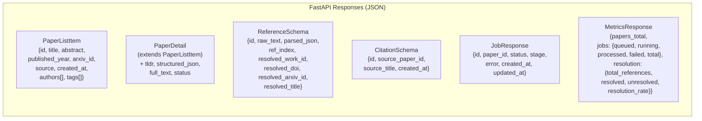

---

## Appendix: Technology Stack

| Layer | Technology | Version | Purpose |
|---|---|---|---|
| Frontend | Next.js | 16.1.6 | React Server Components + Turbopack |
| Frontend | React | 19 | UI rendering |
| Frontend | TypeScript | 5 | Type safety |
| Frontend | Tailwind CSS | 4.0 | Styling |
| Backend | FastAPI | 0.115.12 | REST API framework |
| Backend | Pydantic | v2 | Schema validation |
| Backend | SQLAlchemy | (async) | ORM with aiosqlite |
| Backend | Alembic | — | Schema migrations |
| Backend | Huey | 2.5.3 | Task queue (SQLite backend) |
| Backend | PyMuPDF (fitz) | — | PDF text extraction |
| Backend | httpx | — | Async HTTP client for external APIs |
| Backend | slowapi | — | Rate limiting |
| Database | SQLite | 3 (WAL mode) | Primary database + FTS5 |
| Containerization | Docker | — | Production packaging |
| Test runner (backend) | pytest + pytest-asyncio | 8.3.5 / 0.24.0 | Backend unit + integration tests |
| Test runner (frontend) | Vitest | 4.x | Frontend unit + component tests |
| E2E tests | Playwright | 1.58 | Frontend end-to-end |
