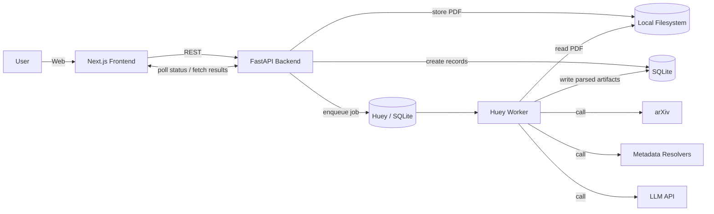

# Architecture Specification (MVP) — Research Paper Ingestion, Cataloging, and Citation Lineage
**Jira Epic:** KAN-4  
**Status:** v1.0 (As-Built — MVP Delivered)  
**Last updated:** 2026-03-08

> **Change log:**  
> v1.0 (2026-03-08): Promoted from Draft v0.2 to v1.0. Reflects as-built state of the delivered MVP. Key changes vs v0.2: Huey confirmed as task queue (no Celery/Redis); CORS middleware added (KAN-38 live-stack test finding); `venv/` is the virtual environment directory (not `.venv/`); Vitest added to frontend test stack; FTS5 confirmed available via `python:3.12-slim` image; deduplication strategy is checksum + arXiv ID.

## 1. Purpose
Build an MVP web app that can:
- Ingest papers via **PDF upload** and **arXiv URL**
- Parse and store **searchable text + basic metadata**
- Generate **summaries + tags**
- Extract and resolve **bibliography references** (Option B)
- Display **outbound references** and **inbound citations**
- Run processing **asynchronously** with visible job status

Non-goals for MVP: full graph visualization, RAG Q&A, figures/tables extraction, math fidelity, inline citation marker mapping, full manual review UI (but preserve unresolved items for later review).

---

## 2. Tech Stack
### Frontend
- **Next.js** (TypeScript), App Router
- UI: TailwindCSS (+ optional component library)
- Data fetching: fetch/React Query (optional)
- Simple list/detail pages (MVP)

### Backend
- **FastAPI** (Python)
- **SQLAlchemy** ORM (to allow future migration to Postgres)
- Pydantic models
- Auth: MVP can be single-user/no-auth or simple auth later (see Security)

### Async Processing
- **Huey** task queue (SQLite backend)
- No external broker required (replaces Celery + Redis)

### Storage
- **SQLite** (primary DB)
  - SQLite FTS5 for keyword search
  - pgvector / embeddings deferred to post-MVP (will require Postgres migration)
- **Local filesystem** for PDFs (configurable directory, behind a storage abstraction layer for future S3 swap)

### External Services
- arXiv API / arXiv endpoints (metadata + PDF fetch)
- DOI metadata resolver (via a DOI metadata provider)
- Scholarly metadata search for title/author/year resolution (provider chosen during implementation)
- Hosted LLM API for summaries/tags (allowed per requirements)

### Migration Path (Post-MVP)
When scaling beyond single-user / ~200 papers:
- SQLite → **Managed Postgres** (+ pgvector for embeddings)
- Huey → **Celery + Redis** (for multi-worker scaling and monitoring)
- Local filesystem → **S3-compatible object storage**
- SQLAlchemy ORM usage throughout ensures the DB migration is mechanical

---

## 3. High-Level Architecture



---

## 4. Core User Flows

### 4.1 Add paper via PDF upload

1. User uploads PDF in UI
2. API stores PDF on local filesystem; computes checksum
3. API creates `paper` + `paper_file` records (or links existing if checksum match)
4. API creates `job` record and enqueues Huey task
5. UI shows status “Queued/Processing/Processed/Failed”
6. When processed, user can open paper detail and see outputs

### 4.2 Add paper via arXiv URL

1. User pastes arXiv URL
2. API normalizes arXiv id, creates record (dedupe by arXiv id)
3. API downloads PDF (or worker does it), stores on local filesystem
4. Pipeline runs as above; metadata includes arXiv fields

### 4.3 Browse library / search

* Library list view with keyword search + filters (tag/author/year)
* Paper detail view shows summaries/tags + citations

---

## 5. Processing Pipeline (Async Job)

### Job States

`QUEUED → RUNNING → (PROCESSED | FAILED)`

Optional: stage progress (`FETCH`, `PARSE`, `CHUNK`, `SUMMARIZE`, `TAG`, `REF_EXTRACT`, `REF_RESOLVE`, `INDEX`)

### Pipeline Steps (MVP)

1. **Fetch**

   * If arXiv: fetch metadata + PDF (if not already stored)
2. **Parse text**

   * Best-effort extraction for two-column PDFs
   * Store extracted full text
3. **Extract basic metadata**

   * title, authors, abstract (best-effort; arXiv metadata preferred when available)
4. **Chunk**

   * Split text into chunks for search/retrieval
5. **Summarize**

   * TL;DR and structured summary (Problem/Approach/Results/Limitations)
6. **Tag**

   * tags from: keywords + arXiv categories + model-generated tags
7. **Reference extraction**

   * detect reference section; extract bibliography entries; parse fields if possible
8. **Reference resolution (Option B)**

   * DOI → arXiv id → title/author/year search
   * Precision-first: only accept high-confidence matches; otherwise mark unresolved
9. **Create citation edges**

   * store outbound edges for resolved works
   * store inbound relationships when other papers reference this work/paper

---

## 6. Data Model (MVP)

> Naming is illustrative; exact names can be adapted.
> All tables stored in SQLite. Use SQLAlchemy models to keep migration to Postgres straightforward.

### Core Entities

* `papers`

  * `id`, `source` (UPLOAD|ARXIV), `title`, `abstract`, `published_year`, `created_at`
* `paper_authors`

  * `paper_id`, `author_order`, `name`
* `paper_files`

  * `paper_id`, `storage_path`, `checksum_sha256`, `mime_type`, `size_bytes`
* `jobs`

  * `id`, `paper_id`, `status`, `stage`, `error`, `created_at`, `updated_at`
* `paper_text`

  * `paper_id`, `full_text` (or separate `paper_text_versions`)
* `paper_chunks`

  * `id`, `paper_id`, `chunk_index`, `text`, `start_offset`, `end_offset`

### Summaries & Tags

* `paper_summaries`

  * `paper_id`, `tldr`, `structured_json`, `model`, `created_at`
* `tags`

  * `id`, `tag`
* `paper_tags`

  * `paper_id`, `tag_id`, `source` (KEYWORD|ARXIV|LLM)

### Citation Graph (Option B)

* `works` (canonical external work)

  * `id`, `doi`, `arxiv_id`, `title`, `year`, `venue`, `authors_json`, `source`
* `paper_references` (raw extracted bib entries)

  * `id`, `paper_id`, `raw_text`, `parsed_json`, `ref_index`
* `reference_resolutions`

  * `reference_id`, `work_id`, `confidence`, `method`, `status` (RESOLVED|UNRESOLVED)
* `citations`

  * `id`, `source_paper_id`, `target_work_id`, `created_at`
  * (optional) `target_paper_id` when the target is in-library and can be linked

### Search

* SQLite FTS5 virtual tables:

  * Index on `papers.title`, `paper_text.full_text`, `paper_chunks.text`
* Embeddings (deferred to post-MVP):

  * Will require Postgres + pgvector migration

---

## 7. API Surface (MVP)

Base path: `/api`

### Ingestion

* `POST /papers/upload`

  * multipart PDF upload
  * returns `{paper_id, job_id}`
* `POST /papers/arxiv`

  * body `{ arxiv_url }`
  * returns `{paper_id, job_id}`

### Status

* `GET /jobs/{job_id}`

  * returns `{status, stage, error?}`

### Library

* `GET /papers`

  * query: `q`, `tag`, `author`, `year`, pagination
* `GET /papers/{paper_id}`

  * returns metadata + summaries + tags + citation counts

### Citations

* `GET /papers/{paper_id}/references`

  * outbound refs (raw + resolved if available)
* `GET /papers/{paper_id}/citations`

  * inbound citations (within system scope)

---

## 8. Frontend Pages (MVP)

* `/` (Library)

  * search bar + filters + list
* `/add`

  * upload PDF + arXiv URL form
* `/papers/[id]`

  * paper detail: metadata, summaries, tags, references + inbound citations
* Optional: job status widget in library and detail pages

---

## 9. Resolution Strategy (Precision-First)

Goal: very low false positives; allow unresolved items.

* If DOI present → resolve directly
* If arXiv id present → resolve directly
* Else query by title/authors/year
* Compute confidence score (string similarity + year match + author overlap)
* Accept only above threshold; otherwise store unresolved

**MVP rule:** do not silently accept low-confidence matches.

---

## 10. Observability (MVP)

Minimum:

* Job logs per paper (stage transitions + errors)
* Metrics table/counters:

  * processed count, failed count
  * extracted ref count
  * resolved ref count + unresolved rate

Nice-to-have later:

* centralized logging + dashboards
* tracing across API/worker

---

## 11. Security & Privacy

MVP options (choose one early):

* **Single-user / no-auth** in a private deployment (fastest)
* Add simple auth later (JWT / OAuth) once multi-user is needed

Baseline requirements:

* Store PDFs in a non-web-accessible directory (not served directly by the frontend)
* Use API endpoint to serve PDF downloads (with path traversal protection)
* Keep API keys in environment variables/secrets manager
* Rate-limit ingestion endpoints (basic protection)

---

## 12. Deployment Topology (MVP)

* Frontend: hosted (Vercel or similar) OR same machine behind reverse proxy
* Backend: FastAPI process (directly or containerized)
* Worker: Huey worker process (same machine)
* DB: SQLite file (local to backend)
* PDFs: Local filesystem directory

**Total running processes: 2** (FastAPI server + Huey worker)

Optional: single Dockerfile / docker-compose with both processes for easy deployment.

---

## 13. Scaling Notes (Target: ~200 papers)

* Single worker handles the full load; Huey supports concurrent workers if needed
* Keep jobs idempotent:

  * safe to re-run a paper processing step
  * dedupe by checksum/arXiv id
* Store intermediate artifacts in DB for debugging (at least raw ref strings)
* SQLite write concurrency is sufficient for single-user / low-throughput MVP
* For post-MVP scale: migrate to Postgres + Celery + S3 (see §2 Migration Path)

---

## 14. Risks / Known Unknowns

* PDF extraction quality varies by publisher/layout
* Reference parsing is noisy; may require heuristic iteration
* Title-based resolution depends heavily on chosen metadata provider quality
* “Near perfect” citation graph will likely require a later **review UI** (post-MVP)
* SQLite write-lock contention under concurrent load (acceptable for MVP scale)

---

## 15. Technical Decisions (Closed)

> All decisions below were finalised during the KAN-37 spike.

* **PDF text extraction library:** PyMuPDF (`pymupdf` / `fitz`) — best extraction quality for two-column academic PDFs, MIT-licenced, actively maintained. Selected over `pdfminer.six` and `pypdf`. *(Unblocks KAN-14)*
* **Metadata resolver(s) for DOI/title search:** OpenAlex API (primary) — CC0 data, no auth required, generous polite-pool rate limits; CrossRef REST API (fallback) — authoritative DOI database. *(Unblocks KAN-19)*
* **DB migration tool:** Alembic ✅ — already implemented (KAN-7). Works with SQLite + SQLAlchemy; forward-compatible with Postgres.
* **Auth decision for MVP:** No-auth (single-user). No login required for MVP. API is localhost-only. Auth deferred to post-MVP hardening sprint.
* **Hosting for MVP:** Self-hosted VM — `uvicorn` backend + Huey worker on the same machine; Next.js frontend on Vercel or the same VM behind nginx reverse proxy.

---

```
```
