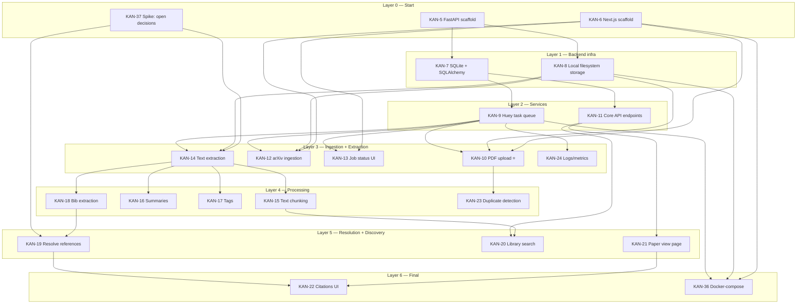

# KAN-4 Dependency Plan & Story Ordering
**Epic:** KAN-4 — MVP: Research paper ingestion, cataloging, and citation lineage  
**Created:** 2026-03-06  
**Spec version:** v0.2 (SQLite / Huey / Local filesystem)

---

## Steel Thread

The minimum path to get a PDF from user upload to a stored database record:

| Order | Story | Delivers |
|---|---|---|
| 1 | **KAN-5** Scaffold FastAPI backend | API can receive requests |
| 2 | **KAN-7** SQLite + SQLAlchemy + migrations | Records can be persisted |
| 3 | **KAN-10** PDF upload (API + UI) | PDF stored, paper + file records in DB, job enqueued |

KAN-8 (filesystem storage) and KAN-9 (Huey queue) feed into KAN-10 in parallel.  
**Critical serial path:** KAN-5 → KAN-7 → KAN-9 → KAN-10

---

## Dependency DAG

---

## Layer-by-Layer Breakdown

### Layer 0 — No dependencies (can start immediately)

| Story | Summary | Notes |
|---|---|---|
| KAN-37 | Spike: close remaining open decisions (PDF lib, resolver, auth, hosting) | Unblocks KAN-14, KAN-19 |
| KAN-5 | Scaffold FastAPI backend + core config | Foundation for all backend work |
| KAN-6 | Scaffold Next.js web app + UI foundation | Foundation for all frontend work |

### Layer 1 — Depends on backend scaffold (KAN-5)

| Story | Summary | Blocked by |
|---|---|---|
| KAN-7 | SQLite + SQLAlchemy models + migrations | KAN-5 |
| KAN-8 | Local filesystem storage for PDFs | KAN-5 |

### Layer 2 — Depends on DB and/or storage

| Story | Summary | Blocked by |
|---|---|---|
| KAN-9 | Huey task queue + worker runtime | KAN-7 |
| KAN-11 | Core API endpoints (library + paper detail) | KAN-7 |

### Layer 3 — Ingestion and extraction

| Story | Summary | Blocked by |
|---|---|---|
| KAN-10 | PDF upload (API + UI) | KAN-9, KAN-8, KAN-6 |
| KAN-12 | arXiv URL ingestion (API + UI) | KAN-9, KAN-8, KAN-6 |
| KAN-13 | Job status tracking + UI | KAN-9, KAN-6 |
| KAN-14 | PDF text extraction + basic metadata | KAN-9, KAN-8, KAN-37 |
| KAN-24 | Processing logs/metrics | KAN-9 |

### Layer 4 — Processing (depends on extracted text)

| Story | Summary | Blocked by |
|---|---|---|
| KAN-15 | Text chunking for searchable storage | KAN-14 |
| KAN-16 | Generate summaries (TL;DR + structured) | KAN-14 |
| KAN-17 | Generate and store tags | KAN-14 |
| KAN-18 | Extract bibliography/reference entries | KAN-14 |
| KAN-23 | Duplicate detection (checksum) | KAN-10 |

### Layer 5 — Resolution and discovery

| Story | Summary | Blocked by |
|---|---|---|
| KAN-19 | Resolve references + create citation edges | KAN-18, KAN-37 |
| KAN-20 | Library search (keyword + filters) | KAN-11, KAN-15 |
| KAN-21 | Paper view page | KAN-11 |

### Layer 6 — Final integration

| Story | Summary | Blocked by |
|---|---|---|
| KAN-22 | Outbound references + inbound citations UI | KAN-19, KAN-21 |
| KAN-36 | Containerise + docker-compose | KAN-9, KAN-8, KAN-6 |

---

## Parallelisation Opportunities

Stories within the same layer can be worked in parallel once their dependencies are met:

- **Layer 0:** KAN-37, KAN-5, KAN-6 are fully independent — all three can start day one.
- **Layer 1:** KAN-7 and KAN-8 are independent of each other.
- **Layer 3:** KAN-10 and KAN-12 can be built in parallel; KAN-13 and KAN-24 are also independent.
- **Layer 4:** KAN-15, KAN-16, KAN-17, KAN-18 are all independent — maximum parallelism here.
- **Layer 5:** KAN-20 and KAN-21 are independent of each other.

---

## Jira Link Summary

All dependency relationships are captured in Jira as **Blocks** links (31 total). Each story's Jira page shows what it blocks and what blocks it.
