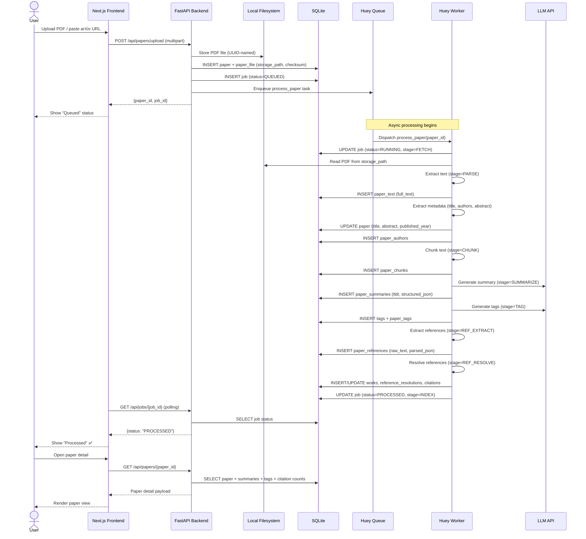

# Steel Thread Design — KAN-4 MVP
**Maintained by:** @Architect  
**Last updated:** 2026-03-06  
**Spec:** [KAN-4-architecture-specification.md](../KAN-4-architecture-specification.md) (v0.2)  
**Dependency Plan:** [KAN-4-dependency-plan.md](../KAN-4-dependency-plan.md)

---

## 1. What is the Steel Thread?

The **minimum end-to-end path** that proves the system works: a PDF goes in, gets stored, a record lands in the database, and a job is enqueued for processing. This is the thinnest vertical slice through every layer of the architecture.

---

## 2. End-to-End Flow



---

## 3. Layer Map

| Layer | Technology | Role | Stories |
|---|---|---|---|
| **User Interface** | Next.js (App Router, TailwindCSS) | Upload form, library list, paper detail, job status | KAN-6, KAN-10, KAN-12, KAN-13, KAN-20, KAN-21, KAN-22 |
| **API** | FastAPI + Pydantic v2 | REST endpoints, file upload, status polling | KAN-5, KAN-10, KAN-11, KAN-12 |
| **Task Queue** | Huey (SQLite backend) | Job dispatch and worker orchestration | KAN-9 |
| **Worker** | Huey consumer process | Pipeline execution (parse → chunk → summarize → tag → resolve) | KAN-14, KAN-15, KAN-16, KAN-17, KAN-18, KAN-19 |
| **Database** | SQLite + SQLAlchemy + FTS5 | All persistent data, job state, search indexes | KAN-7 |
| **File Storage** | Local filesystem (configurable dir) | PDF persistence | KAN-8 |
| **External APIs** | arXiv, DOI resolvers, LLM | Metadata fetch, reference resolution, summaries/tags | KAN-12, KAN-19, KAN-16, KAN-17 |

---

## 4. Steel Thread Stories (Critical Path)

The absolute minimum stories to complete the steel thread:

```
KAN-5 (FastAPI scaffold)
  → KAN-7 (SQLite + SQLAlchemy)
    → KAN-9 (Huey task queue)
      → KAN-10 (PDF upload endpoint)
```

With **KAN-8** (filesystem storage) running in parallel to KAN-7, and **KAN-6** (Next.js scaffold) running in parallel to all backend work.

| Order | Story | What it proves |
|---|---|---|
| 1 | KAN-5 | API process starts, accepts requests, returns health check |
| 2 | KAN-7 + KAN-8 (parallel) | Database schema exists; PDFs can be stored on disk |
| 3 | KAN-9 | Jobs can be enqueued and consumed by a worker |
| 4 | KAN-10 | **Full thread:** PDF uploaded → stored → DB record created → job enqueued |

---

## 5. Data Flow (per pipeline stage)

| Stage | Input | Output (DB) | Output (FS) |
|---|---|---|---|
| **Upload/Fetch** | PDF file or arXiv URL | `papers`, `paper_files`, `jobs` | PDF file on disk |
| **Parse** | PDF on disk | `paper_text` | — |
| **Metadata** | Extracted text / arXiv API | `papers` (updated), `paper_authors` | — |
| **Chunk** | `paper_text.full_text` | `paper_chunks` | — |
| **Summarize** | `paper_text.full_text` → LLM | `paper_summaries` | — |
| **Tag** | `paper_text.full_text` → LLM | `tags`, `paper_tags` | — |
| **Ref Extract** | `paper_text.full_text` | `paper_references` | — |
| **Ref Resolve** | `paper_references` → external APIs | `works`, `reference_resolutions`, `citations` | — |

---

## 6. Key Invariants

1. **Idempotency:** Re-processing a paper must not create duplicate records. Dedupe by checksum (PDF upload) or arXiv ID (URL ingestion).
2. **Precision-first resolution:** Never silently accept a low-confidence reference match. Store as UNRESOLVED.
3. **Job state machine:** `QUEUED → RUNNING → (PROCESSED | FAILED)`. No other transitions permitted.
4. **Storage abstraction:** All file I/O goes through the storage abstraction layer — never use raw paths outside the storage module.
5. **SQLAlchemy everywhere:** No raw SQL except FTS5 virtual table setup. ORM usage ensures future Postgres migration is mechanical.

---

## 7. Delta Updates

Any implementation that deviates from this design must be proposed as a Delta Update:

| Date | Story | Delta | Approved by |
|---|---|---|---|
| _(none yet)_ | | | |

> Devs: if your implementation requires a change to this flow (new table, different stage ordering, additional external service), add a row here and get @Architect sign-off before merging.
