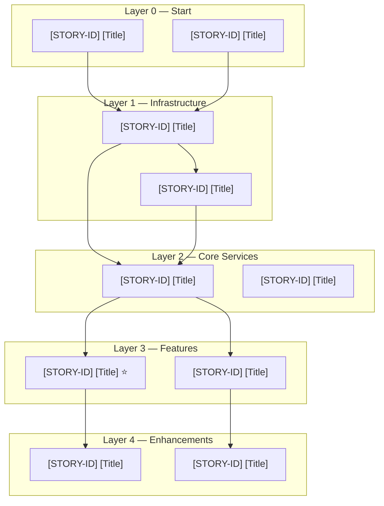

# [EPIC_ID] Dependency Plan & Story Ordering
**Epic:** [EPIC_ID] — [Epic title]  
**Created:** [DATE]  
**Spec version:** [Architecture spec version]

> **Usage:** Fill this in after the Architecture Specification is written but before sprint planning. It maps which stories must be built in which order and identifies the critical serial path (the steel thread). Update it when new stories are added or dependencies change.

---

## Steel Thread

The minimum path to prove the system works end-to-end. List only the stories that form the critical serial path.

| Order | Story | Delivers |
|---|---|---|
| 1 | **[STORY-ID]** [Story title] | [What capability this unlocks] |
| 2 | **[STORY-ID]** [Story title] | [What capability this unlocks] |
| 3 | **[STORY-ID]** [Story title] | [What capability this unlocks] |

Note any parallel enablers that feed the steel thread:  
**Critical serial path:** [STORY-ID] → [STORY-ID] → [STORY-ID]

---

## Dependency DAG

> ⭐ marks the steel thread bottleneck — the single story that most other work depends on.

---

## Layer Definitions

| Layer | Stories | Dependency |
|---|---|---|
| **Layer 0** | [STORY-IDs] | No dependencies — can start immediately |
| **Layer 1** | [STORY-IDs] | Requires Layer 0 complete |
| **Layer 2** | [STORY-IDs] | Requires specific Layer 1 stories |
| **Layer 3** | [STORY-IDs] | Requires specific Layer 2 stories |
| **Layer 4** | [STORY-IDs] | Requires Layer 3 complete |

---

## Parallelism Analysis

Describe which stories can be worked in parallel and which are blocking.

- **Can be parallelised:** [List story pairs/groups that can be worked simultaneously]
- **Must be serial:** [List the stories that form a strict ordering constraint]
- **Independent from steel thread:** [Stories that can progress independently]

---

## Sprint Allocation (suggested)

| Sprint | Stories | Goal |
|---|---|---|
| Sprint 1 | [STORY-IDs] | [Sprint goal] |
| Sprint 2 | [STORY-IDs] | [Sprint goal] |
| Sprint 3 | [STORY-IDs] | [Sprint goal] |

---

## Risk Register

| Risk | Affected Stories | Mitigation |
|---|---|---|
| [Risk 1, e.g. "Library choice not yet resolved"] | [STORY-IDs] | [Spike story [STORY-ID] must close first] |
| [Risk 2] | [STORY-IDs] | [Mitigation] |
