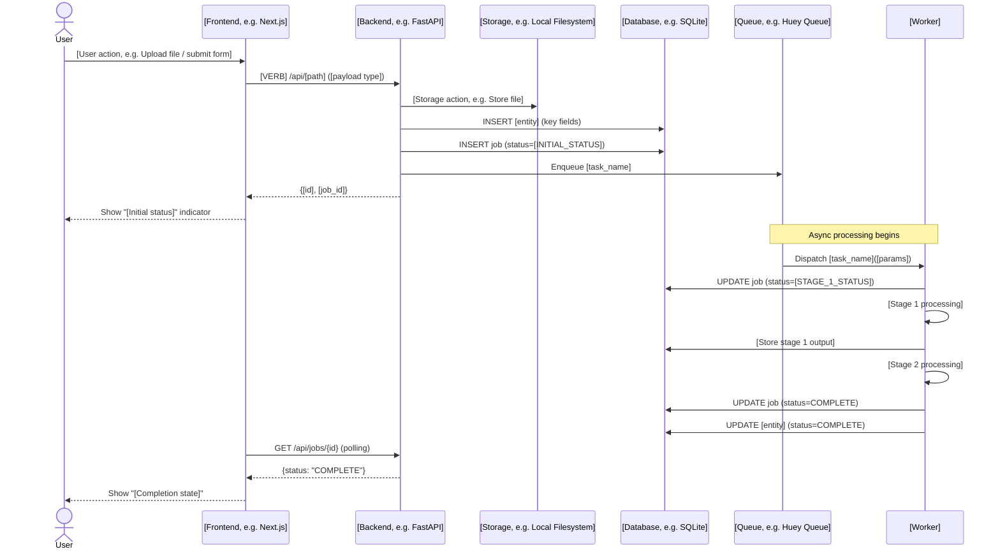

# Steel Thread Design — [PROJECT_NAME] / [EPIC_ID]
**Maintained by:** @Architect  
**Last updated:** [DATE]  
**Spec:** [[EPIC_ID]-architecture-specification.md](../[EPIC_ID]-architecture-specification.md)  
**Dependency Plan:** [[EPIC_ID]-dependency-plan.md](../[EPIC_ID]-dependency-plan.md)

> **Usage:** Created before sprint 1 begins. Defines the minimum vertical slice through every layer of the architecture. Updated by @Architect via the Delta Update process as the actual implementation evolves. This is a living document — it should reflect the *actual* implementation, not just the original design.

---

## 1. What is the Steel Thread?

The **minimum end-to-end path** that proves the system works: [describe the simplest possible flow — input goes in, it travels through every layer, output comes out]. This is the thinnest vertical slice through every layer of the architecture.

---

## 2. End-to-End Flow



---

## 3. Layer-by-Layer Implementation

For each layer in the steel thread, document which files implement it and exactly what they do.

### Layer: [Frontend, e.g. Next.js]

| File | Purpose |
|---|---|
| `web/src/app/[route]/page.tsx` | [What this page renders and submits] |
| `web/src/components/[Component].tsx` | [What this component does — Server or Client?] |
| `web/src/lib/api.ts` | [API client functions used by this layer] |

### Layer: [Backend API, e.g. FastAPI]

| File | Purpose |
|---|---|
| `src/api/[module].py` | [Routes this module exposes; schemas it validates] |
| `src/schemas/[schema].py` | [Pydantic models used at this layer] |
| `src/main.py` | [Middleware registered: CORS, rate limiting, etc.] |

### Layer: [Storage]

| File | Purpose |
|---|---|
| `src/storage/[impl].py` | [How files/assets are stored and retrieved] |

### Layer: [Database]

| File | Purpose |
|---|---|
| `src/db/models.py` | [Tables and their key fields] |
| `src/db/session.py` | [Session management / connection factory] |
| `alembic/versions/` | [Current migration state] |

### Layer: [Task Queue / Worker]

| File | Purpose |
|---|---|
| `src/worker/[tasks].py` | [Tasks defined here; what each stage does] |
| `src/services/[service].py` | [Business logic called by each task] |
| `src/worker/[queue_app].py` | [Queue configuration and worker startup] |

---

## 4. Data Flow Summary

Show the data transformations as the input travels through the system.

```
Input: [what the user provides]
  ↓
[Layer 1]: [what happens]
  ↓  Produces: [artifact]
[Layer 2]: [what happens]
  ↓  Produces: [artifact]
[Worker Stage 1]: [what happens]
  ↓  Produces: [artifact stored in DB]
[Worker Stage N]: [what happens]
  ↓
Output: [what the user gets back]
```

---

## 5. Delta Update Log

Record every deviation from the original design here. Each delta requires @Architect approval.

| Date | Story | Change | Approved by |
|---|---|---|---|
| [DATE] | [STORY-ID] | [Describe the deviation from original design] | @Architect |

---

## 6. Open Design Questions

| # | Question | Spike | Status |
|---|---|---|---|
| 1 | [Question that affects the steel thread design] | [STORY-ID] | Open / Resolved |
